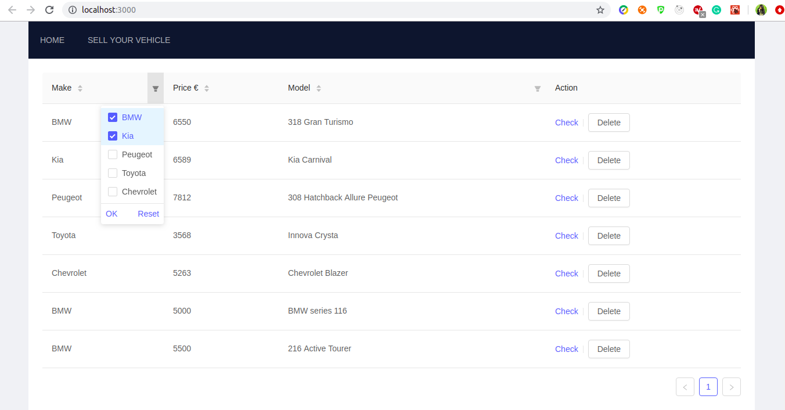
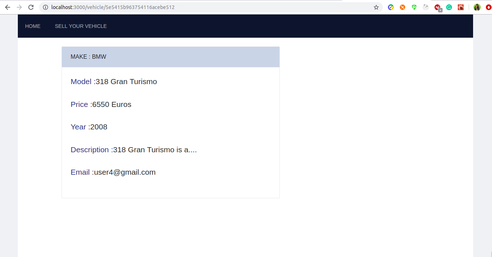
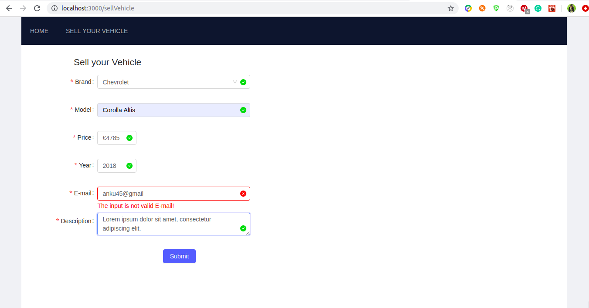

# Fullstack coding challenge

The Frontend of the application was bootstrapped with [Create React App](https://github.com/facebook/create-react-app) and the Backend is a RESTful service implemented as a Java springboot application. MongoDB is used locally for the persistance storage of data. [Ant-design](https://ant.design/) is used to design the web interface.

### Prerequisites

- JRE 8
- NodeJS
- Package Manager (NPM)
- MongoDB

### Backend

To start the springboot application, you can:

- Follow [link](http://www.appsdeveloperblog.com/run-spring-boot-app-from-a-command-line/) to run it on Terminal.
- Follow [link](https://www.jetbrains.com/help/idea/spring-boot.html) to run on intelliJ
- Follow [link](https://spring.io/blog/2015/03/18/spring-boot-support-in-spring-tool-suite-3-6-4) to run on Spring tool suite

### Frontend

In the project directory, you can run:

##### `cd frontend`

##### `npm install`

##### `npm start`

Runs the app in the development mode.
Open [http://localhost:3000](http://localhost:3000) to view it in the browser.

### Screenshots

The application consists of 3 pages-

##### Home Page

Home page where all the car's/vehicle's meta-data (Make, Model, Price) are listed for the sale. Each column can be filtered, sorted and reset as seen in the figure below. The corresponding action is listed to check further details or delete the listing(to demonstrate the delete API).

##### Vehicle Page

When clicked on "check" action, the details of the respective vehicle is displayed as below.

#### Vehicle Form Page

The "SELL YOUR VEHICLE" option in the Navigation Bar leads to a form that helps in creating a listing with all the required details (each field is validated for its type).

### API

To test the APIs, you can import the file "API Set.postman_collection.json" (in the backend folder) to postman. The APIs are to perform basic CRUD operations.
